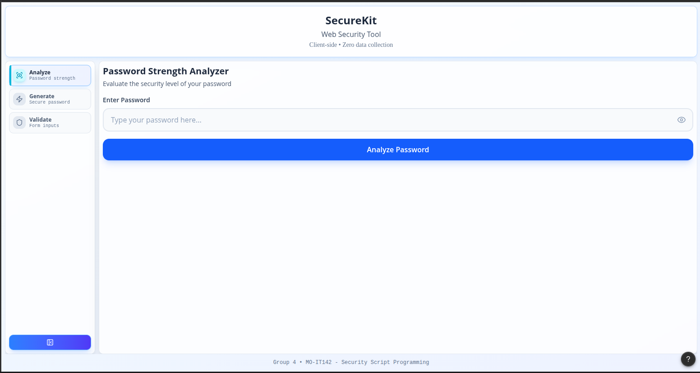
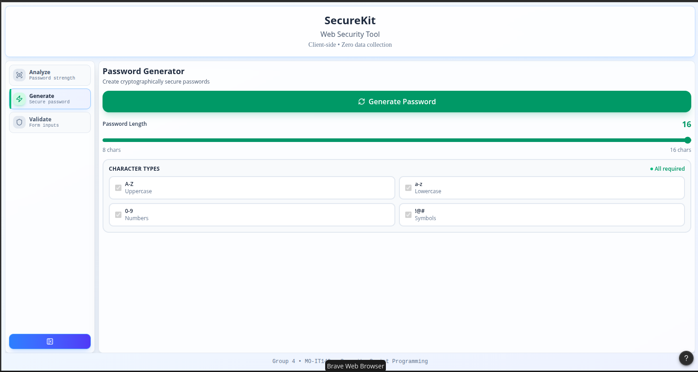
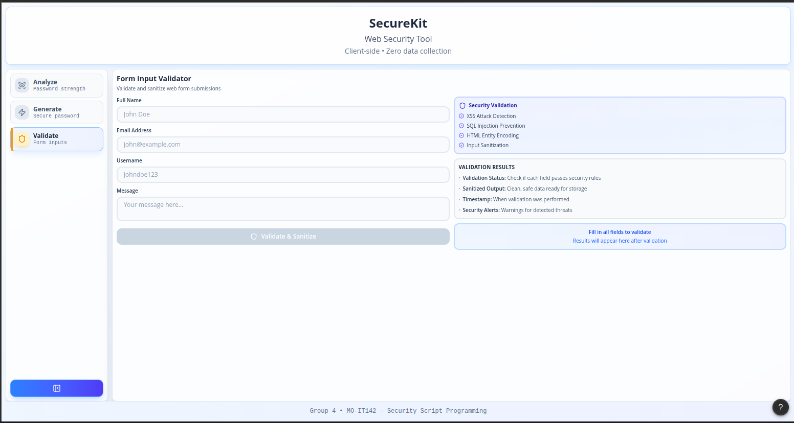

# 🛡️ Web Security Tool (Security Script Programming Project)

## 📌 Project Overview

This project is a **Python-based Web Security Tool** developed as part of the **Security Script Programming** course.
It focuses on identifying and mitigating common security risks related to **password strength**, **password generation**, and **basic web security checks**.

The tool is designed to be **modular**, **easy to extend**, and **beginner-friendly**, making it suitable for both educational and practical security use cases.

**Live Demo:** https://milestone-1-web-security-tool-group-4.onrender.com/

---

## 🎯 Objectives

- Assess password strength using multiple security checks
- Generate secure passwords based on user-defined criteria
- Promote awareness of common security vulnerabilities
- Apply secure scripting practices in Python

---

## 🚀 Features

- ✅ **Password Strength Assessment**
  - Checks for common passwords, dictionary words, length, and complexity.
  - Provides an entropy score using `zxcvbn`.
  
  

- 🔐 **Password Generator**
  - Generates strong, random passwords.
  - Supports customizable length and character sets.

  

- 🛡️ **Input Validator**
  - Validates common input fields like names, emails, and usernames.
  - Sanitizes input to protect against basic SQL injection patterns.

  

- 🧩 **Modular Architecture**
  - Easy to maintain and extend.
  - Separate components for assessment, generation, and utilities.

- 🖥️ **Simple GUI / Web Interface**
  - User-friendly interaction for both desktop and web.
  - Designed for academic demonstration.

---

## 🏗️ Project Structure

```
Milestone-1-Web-Security-Tool-Group-4/
├── .gitignore
├── api.py                      # FastAPI backend server
├── run.py                      # Desktop GUI launcher
├── requirements.txt            # Python dependencies
├── runtime.txt                 # Python version for deployment
├── README.md
│
├── frontend/                   # React + TypeScript frontend
│   ├── public/
│   ├── src/
│   │   ├── assets/
│   │   ├── components/
│   │   │   ├── PasswordStrength.tsx
│   │   │   ├── PasswordGenerator.tsx
│   │   │   └── InputValidator.tsx
│   │   ├── App.tsx             # Main React app
│   │   └── main.tsx            # React entry point
│   ├── package.json
│   └── vite.config.ts
│
├── src/
│   └── web_security_tool/      # Python backend modules
│       ├── __init__.py
│       ├── input_validator.py
│       ├── main.py             # CustomTkinter GUI main app
│       ├── password_assessor.py
│       ├── password_generator.py
│       ├── services.py
│       ├── utils.py
│       └── gui/                # GUI components
│           ├── components/     # Reusable GUI components
│           ├── analyze.py
│           ├── generate.py
│           └── validate.py
```

---

## ⚙️ Technologies Used

### Backend

- **Python 3.11+** – Core programming language
- **FastAPI** – Modern web framework for building APIs
- **Uvicorn** – ASGI server for running FastAPI
- **CustomTkinter** – Modern GUI framework for desktop application
- **bcrypt** – Secure password hashing
- **zxcvbn** – Password strength estimation library
- **requests** – HTTP library for API calls
- **Pillow (PIL)** – Image processing for GUI icons
- **openpyxl** – Excel file generation for exports
- **pyperclip** – Clipboard operations
- **darkdetect** – System theme detection

### Frontend

- **React 18** – JavaScript library for building user interfaces
- **TypeScript** – Typed superset of JavaScript
- **Vite** – Fast frontend build tool and dev server
- **Tailwind CSS** – Utility-first CSS framework (inferred from modern React setup)

### Development & Deployment

- **Git** – Version control
- **VS Code Dev Containers** – Containerized development environment
- **Render** – Cloud hosting platform

---

## 📦 Installation & Setup

### Prerequisites

- Python 3.11 or higher
- Node.js 18+ (optional, only for frontend development)
- Git

### 1️⃣ Clone the Repository

```bash
git clone https://github.com/shekinahjabez/Milestone-1-Web-Security-Tool-Group-4.git
cd Milestone-1-Web-Security-Tool-Group-4
```

### 2️⃣ Set Up Python Environment

```bash
python -m venv .venv
```

**Activate the virtual environment:**

- **Windows**

  ```bash
  .venv\Scripts\activate
  ```

- **macOS/Linux**
  ```bash
  source .venv/bin/activate
  ```

### 3️⃣ Install Python Dependencies

```bash
pip install -r requirements.txt
```

### 4️⃣ (Optional) Set Up Frontend

If you want to run or modify the React frontend:

```bash
cd frontend
npm install
```

---

## ▶️ Usage

### 🖥️ Desktop GUI Application

Launch the CustomTkinter desktop application:

```bash
python run.py
```

### Features

The tool offers three main functionalities:

- **Password Strength Analyzer** – Test and analyze password security
- **Password Generator** – Create secure, customizable passwords
- **Input Validator** – Validate emails, phone numbers, and more

---

## 📊 Example Output

```plaintext
Password Strength: Strong
Feedback:
- Good length
- Contains uppercase, lowercase, numbers, and symbols
- Not found in common password lists
```

---

## 🔒 Security Considerations

- Passwords are **never stored in plain text**
- Secure hashing techniques are applied where applicable
- Designed strictly for **educational and ethical use**

---

## 📚 Learning Outcomes

- Practical application of Python security scripting
- Understanding password vulnerabilities
- Modular software design
- Dependency management using virtual environments

---

## 👨‍💻 Authors

- **Lenie Joice Mendoza**
- **Leonardo Arellano**
- **Maricar Punzalan**
- **Shekinah Jabez Florentino**

Security Script Programming – Academic Project

---

## 📄 License

This project is intended for **educational purposes only**.
Unauthorized commercial use is not permitted.
